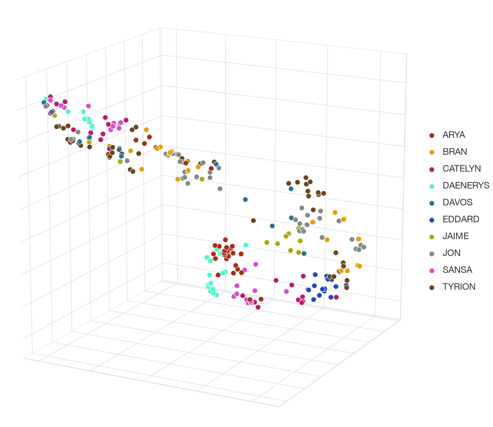
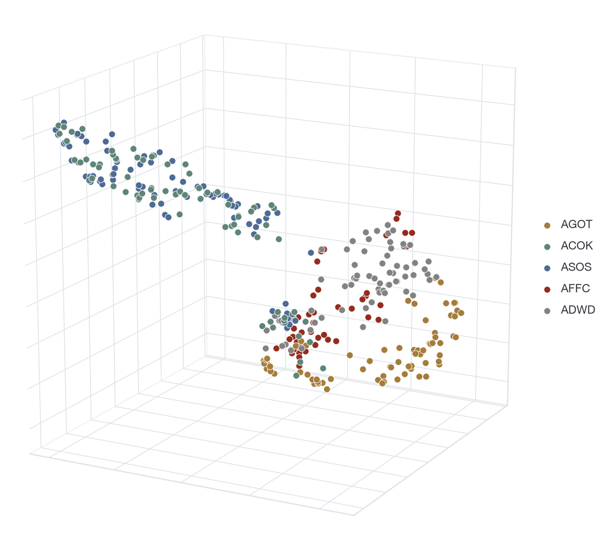

For those of you familiar with either HBO's Game of Thrones, or George RR Martin's A Song of Ice and Fire (ASOIAF), you will probably be aware of the vast differences between each character and the depth of each storyline. For those of you who aren't familiar; each book chapter is written from the perspective of a different character, and George RR Martin writes each character in a distinct and unique way. A chapter written from the perspective of Eddard Stark, an aged and grizzled war veteran, will be portrayed vastly different to a chapter from the perspective of his son, Bran Stark, a 9 year old innocent 'sweet summer child'. 

The stories surrounding all of the characters span continents, explore diverse themes and face different problems, and so we would expect there to be intrinsic differences between the language used for all of these different perspectives. *Can we use Natural Language Processing (NLP) to show how George RR Martin writes each of these characters?* More specifically, is there actually a *mathematical difference* between the chapters, grouped by character, based on the language alone?

**A note on spoilers**: I am not including any excerpts from either the books or the show, and do not discuss the story. However, you will be able to see how many chapters are included for each character, as well as if any characters *stop* having point-of-view chapters after a specific book. 

## How are we going to use NLP for Game of Thrones? 

To show how characters are different amongst the ASOIAF books, I will use [BERT](https://arxiv.org/pdf/1810.04805.pdf), which is a NLP model built by Google, and an extremely powerful tool which can output *sentence embeddings*. Put simply, a sentence embedding is a sequence of words, e.g. a sentence, which has been converted to a very high-dimensional mathematical vector. The vector itself won't have any meaning to you or I on its own, but it has context relative to other sentences. For example, if two different sentence embeddings are very far away from each other, we can probably infer that the two original sentences are quite different.
 
BERT can achieve this as it has been trained on a large corpus of language data: [a dataset of books](https://arxiv.org/pdf/1506.06724.pdf) and the full English Wikipedia. One way in which BERT trains is by *masked language modelling*, which means it tries to predict random words in the dataset using the 'transformer' architecture, which is an extremely clever way of incorporating left-to-right and right-to-left directionality in a sentence so that the full context of the word is integrated. By learning where words come in the context of a sentence, BERT learns a lot about the English language. Whilst we aren't trying to predict any words for our task, we will use the information that BERT learned whilst training as our emebeddings. 

Fortunately for us, BERT is made completely open-source and free to use via [Huggingface](https://huggingface.co/bert-base-uncased), a collection of NLP models, datasets, and more. We can extract the embeddings from BERT and visualise them for each chapter to see if there is a strong degree of separation, which would indicate key differences in the language for different characters.

## ASOIAF Embeddings

We can give BERT a sentence from ASOIAF, and it will output a relevant vector which gives information about this sentence. Repeating this for every sentence in the ASOIAF book series, we can obtain the high-dimensional sentence embeddings from each chapter of ASOIAF, by grouping by chapter and taking the average embedding across sentences. 

The embedding dimension output given by the base BERT model is 768, which we definitely cannot visualise. For this reason I have used [UMAP](https://umap-learn.readthedocs.io/en/latest/)^[The UMAP transform was fit with hyperparameters `min_dist = 0` and `n_neighbors = 30`, chosen by trial and error, to try to separate the classes as much as possible. All other values were kept as default in [this function](https://umap-learn.readthedocs.io/en/latest/api.html#umap)], a low-dimension projection method, to reduce the dimension to 3 so that we can visualise it.

## Separation by Character

Below I have plotted the (now 3D) embeddings in an interactive scatter plot, which you can rotate and move around. You can hover over each point to see the point-of-view character for each chapter and the corresponding book, as well as click on character names on the legend to remove them.

<figure class="figure figure-embed">

<noscript></noscript>

<figcaption>Mean BERT sentence embeddings of chapters in ASOIAF, split by character (with each book labelled), restricted to the 10 most frequently occuring point-of-view characters. The dimension was reduced from 768 to 3 using UMAP.</figcaption>
</figure>

It is important to note that *no information about the classes (chapters/characters) was used at any point*, so any structure we can see that separates the different characters or chapters is purely based on the language alone. The factors that could influence this are, for example: word choice, writing style, sentence length, and more.

So what can we infer from this? The key aspects we are looking for are:

 - How clustered are chapters from the same character?
 - How separated are chapters from different characters?
 - Are similar characters close to one another?

### My Interpretation

From what I can see, the honourable and consistent Eddard Stark occupies a distinct region of the plot, and doesn't stray far from it, but he is joined by other chapters from the first book. Daenerys's storyline is mostly separated from the rest of the characters, so it makes sense that her chapters are grouped together and distinct in the plot. Other characters, such as Arya, seem to be uniquely identifiable due to being separated from the other clusters. The questionably lovable dwarf, Tyrion, has a plotline which spans battlefields, court intrigue, romance, death, and more. This seems to be shown here by his embeddings being spread across the entire space, representing the large variability in his changing viewpoints and scenarios. 

Surprisingly, I expected the child characters, most notably Sansa and Bran, to occupy a distinct region because of their naive and childlike viewpoints, but their distributions aren't too different from most other characters. In fact, Jon's and Bran's chapters seem to exist in the same regions of the plot, which could indicate a similarity in the characters, or at least how the characters are written.

## Separation by Book

There seems to be a divide based on the book which each chapter is written in. Just by switching the labels (and removing the top 10 character restriction), we can inspect the same plot with a different angle.

<figure class="figure figure-embed">

<noscript></noscript>

<figcaption>Mean BERT sentence embeddings of chapters in ASOIAF, split by book. The dimension was reduced from 768 to 3 using UMAP.</figcaption>
</figure>

The divide between classes is far more clear in this case^[For completeness, here are the initialisms used for each book. AGOT: A Game of Thrones, ACOK: A Clash of Kings, ASOS: A Storm of Swords, AFFC: A Feast for Crows, ADWD: A Dance with Dragons] - books 2 and 3 (ACOK and ASOS respectively), are far, far, different from the other books in the series. The first, fourth and fifth books (AGOT, AFFC and ADWD respectively), are more closely related, with the first book being in a more distinctive class. Books 4 and 5 were written at the same time, which might explain their embeddings being so intertwined. 

## Final Thoughts

It is interesting how we can *mathematically see the difference in language* based on the book or the character. There is a clear mathematical distinction between writing styles used for different characters, and we have even shown the evolution of George RR Martin's prose over the course of writing the ASOIAF series.

We can see the potential usefulness of these BERT embeddings, and they have far more use outside of plotting them to see their groups. We could've calculated the distance between embeddings to see exactly which characters are the most different or the most similar. We could use the embeddings themselves in a data science application; for example, how well can we classify which character is being written about based on only language? 

Existing research in NLP has given us the avenue to do all of this. It is an extremely interesting field, and is constantly developing. The methods we used here are free, and open to anyone for experimenting with. What other applications do you think would be cool to see? If you would like to ask any questions or have any discussion, [get in touch](mailto:danny@weaviate.io).
