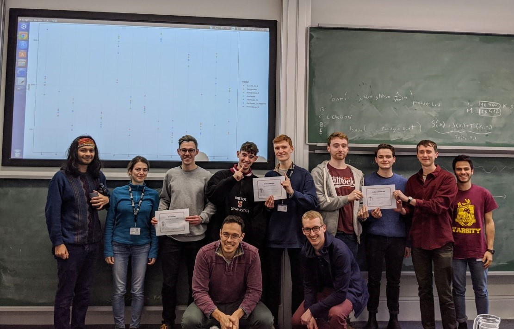

In February I participated in a COMPASS hackathon, where me and my fellow students fit statistical models to try to improve predictions in forecasting electricity demand based on weather related variables.

We were fortunate to be visited by Dr Jethro Browell, a Research Fellow at the University of Strathclyde, who gave a brief lecture on how electricity demand was calculated, and how much it has changed over the last decade. After the lecture, Dr Mateo Fasiolo, a lecturer who works with us, explained a basic Generalised Additive Model (GAM) which can be used to forecast electricity demand for a particular dataset.

Our task was to output a set of predictions for a testing dataset and submit them to the group git repository. We only had access to the predictor variables of this dataset, so we wouldn't know how well our model was doing until it was submit and checked by Dr Fasiolo, who then put all submitted scores on the projector at the front of the room. The team with the lowest root mean squared error at the end would be crowned the winner. 

 Me and my team "Jim" (named so because we went to the gym) performed well at the start, extending the basic GAM to include additional covariates and interactions, as well as including some feature engineering. The second team "AGang" (because all of their names began with "A") took the edge over us by removing a single variable that we didn't realise was actually making our model worse, and their GAM produced better predictions overall by a small margin. The third team "D & D" (because both their names began with a D) was having no luck at all, trying to implement a random forest model as opposed to a GAM, but their predictions were significantly off, and their code took much longer to run than ours, leaving them with little time to troubleshoot.

Try as we did, we were unable to do any better than our original model; but we limited our scope to a GAM, and did not try anything out-of-the-box compared to the other two teams.

The "AGang" were set to win it, until a surprise twist of fate sent "D&D" soaring into the lead, with predictions that had a far smaller error than anyone elses. The random forest model they were fitting before had an error, and they managed to fix the error, finish running the model and submit their predictions with only moments to spare. Thus, we came last. 

This was a fun competition, even though we lost. I realise that our mistake now was that we did not include anything special in our model that accounted for different weather patterns in different regions. Our model would have done very well if it was more variable; so that certain predictors were included in some areas that had more solar power, for instance. The way which we fit the model was the same for all regions, even though they were all quite different.

You can read the article from the Bristol school of mathematics [here](https://www.bristol.ac.uk/maths/news/2020/compass-hackathon.html).