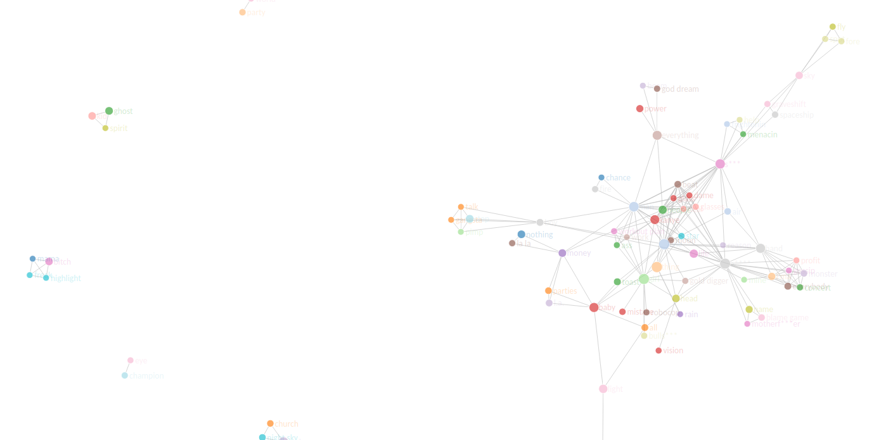
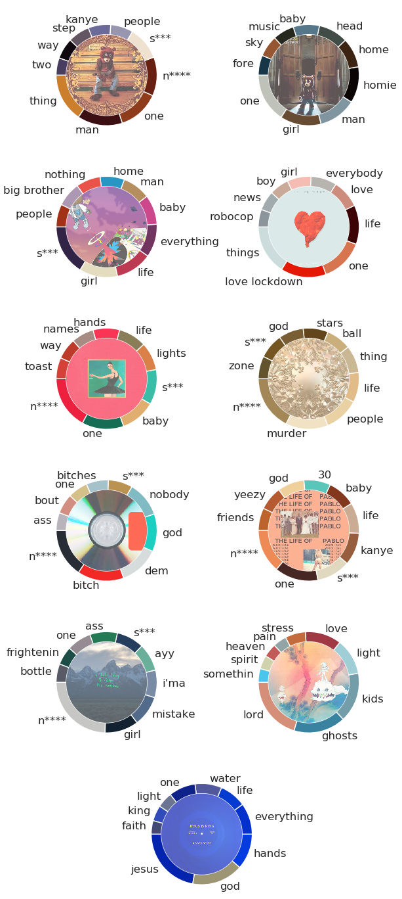
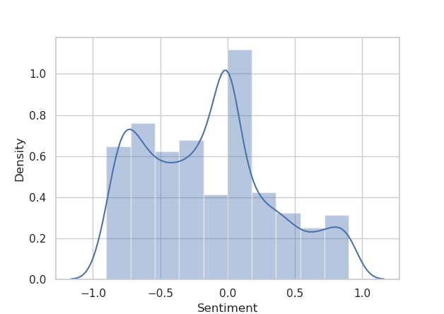
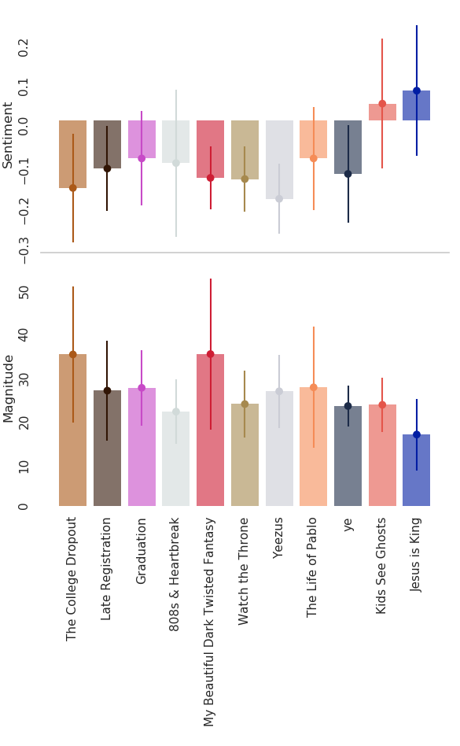
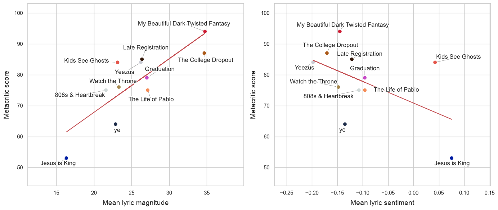

::: note
**IMPORTANT**

This article was written in 2020, before any of Kanye's irredeemable actions. Regardless, I still think the analysis is interesting, and is a fun snapshot of NLP analysis in 2020, before ChatGPT and LLMs took over the world.
:::

Controversy aside, what makes Kanye West so influential to the hip-hop industry? His lyrics must play a part to his success. The [Google Natural Language API](https://cloud.google.com/natural-language/) can perform a full language analysis of Kanye West's lyrics for free. This uses a pre-trained natural language model by Google, and the API is available for use in Python.

The data were mostly obtained by using the [genius](https://cran.r-project.org/web/packages/genius/index.html) package in R, but missing entries were copied and pasted manually from the Genius website. The analysis is restricted to his studio albums, but not solo albums, so that his collaborations with Kid Cudi and Jay Z are included.
All albums considered are *The College Dropout*, *Late Registration*, *Graduation*, *808's & Heartbreak*, *My Beautiful Dark Twisted Fantasy*, *Watch the Throne*, *Yeezus*, *The Life of Pablo*, *ye*, *Kids See Ghosts* and *Jesus is King*. 

This article is split into four sections:

- Entity Analysis
- Sentiment Analysis
- Sentiment and Magnitude against Album Reception
- Generating a New Kanye Song

All code used for the analysis and graphics in this post can be found in the github repository [kanyenet](https://github.com/dannyjameswilliams/kanyenet).

## Entity Analysis

The natural language API provided by Google includes entity analysis - the identification of *entities*, which can be interpreted as the 'important parts' of the text. Each song is passed individually to the API, collating the number of entities for each song. Below is a network of word connections, where the links between nodes represent words that appear in the same song. The graph is interactive, so you can scroll around and zoom in and out to see all the connections. You can click on a node to view the total number of times it appears across all songs. 

It might take a while to load, and is best viewed on desktop. **Content warning:** An effort has been made to censor offensive words, but some may have slipped through the cracks.
::: figure

Network of entities. Connections between nodes represent entities being in the same song. *Click the image to view the interactive graph*
:::

To see a larger version of this network, with the ability to filter by album and minimum number of occurences of a word, [click here to view it as an R shiny app.](https://dannyjameswilliams.shinyapps.io/kanyenetwork/)

This graph only contains entities that appear more than 4 times across all songs, as the full network would contain far too much information, and nothing would be visible. The larger size of the node indicates a word being more frequent across all songs.

Since this undirected graph is *not fully connected*, then it is impossible to connect all entities to each other via other entities that appear in the same song. Here we can also see the most common words at the center of the graph, and as expected, the most frequent words also seem to have the most connections.

We can also note a few interesting qualities; firstly that Kanye never talks about Jesus in a song without also talking about God. Secondly, Kanye only talks about mistakes when he also talks about girls, I wonder what could that mean? 

Themes are also apparent in different clusters of the graph, for example, a small section containing *star*, *moon* and *mars*, or entities such as *workout plan*, *dessert* and *salad* in another section, seemingly referring to exercise and health. Particular songs can also be isolated out at the outer sections of the graph, which explains some of the more uncommon words that appear with few connections.

But how do the frequency of these entities change over time? We can inspect the top 10 entities separately for each album, which gives a good indication of their individual themes, as well as Kanye's use of different lyricism throughout his career.
 

Kanye's albums have a broad range of different themes, which correspond to different entities being more prevalent within them. Kanye's most heartfelt album, *808's & Heartbreak* (the fourth album) contained no curse words, but instead had more references to 'love' and 'life'. It is easy to judge the theme of each album by their most common entities, such as *Jesus is King* (the final one). Again there are no profanities, instead the album is heavily focused on religion, being a gospel album. Here, 'Jesus' is the most common entity, followed by god.

Some of the entities which might seem 'irrelevant' that can be found within these charts often correspond to a single song with purposeful repetition. 'Toast' appears in the top 10 entities for the album *My Beautiful Dark Twisted Fantasy*, not because it is an amazing breakfast food, but because it is repeated in the chorus of *Runaway*.
::: verse
*"Let's have a toast for the douche bags, let's have a toast for the assholes,* 
*Let's have a toast for the scumbags, every one of them that I know"*
:::

As a side note, you may wonder why the word 'amazing' does not appear in the top 10 entities for *808's & Heartbreak*, due to it appearing a whopping 55 times in the song *Amazing*. Thankfully, Google's API does not classify it as an entity, since it is actually an adjective. However, 'love lockdown' and 'robocop' still made it through, as both words are repeated many times in their own songs.

## Sentiment Analysis

Natural language analysis can also classify the *sentiment* of a piece of text, in this case, the sentiment of song lyrics, one song at a time. The sentiment ranges from -1 to 1, where a negative/positive value means the song has a lower/higher sentiment, generally referring to the mood of the song - whether it is more uplifting or sad.

Firstly, the sentiment API extracts the sentiment from each sentence separately. We can take a look at the density of all sentence sentiments below.

So most of the sentence sentiments are negative, in general Kanye's lyrics convey a more sombre tone than they do a positive one. Wording can play a key part in how the natural language analysis measures sentiment. The lowest sentiment sentences are at -0.9, so let's take a look at some examples of these.

- *"Oh, how could you be so heartless?"*
- *"The devil is alive I feel him breathing."*
- *"And when I'm older, you ain't gotta work no more."*

We can see the first two generally are quite negative, but the last one has been misrepresented. In this line, Kanye talks about when he was a kid, he wanted to take care of his mother when she got older so that she wouldn't have to go to work again, but the syntax of the sentence tricked the API into believing it was a generally negative sentence. This isn't very common, but does highlight one of the limitations of this natural language API.

A song's *magnitude* is defined as the sum of the absolute values of the sentiments for each sentence in the song. Quite a mouthful - consider it as the 'emotionality' of the song; the higher the sentiment is (in one way or another), the more emotional the song becomes. We can break down the sentiment and magnitude over all songs by album.

Generally, Kanye's albums are all quite negative, with the exception of *Kids See Ghosts* and *Jesus is King*, his two latest albums. After the release of *Graduation*, Kanye went through various personal traumas. We can see this reflected here, as the sentiment up to *Graduation* was increasing, after which it began decreasing again. Only recently has the sentiment began to increase again.

The album with the lowest sentiment is *Yeezus*, which surprisingly does not have the largest magnitude, although the magnitude does not vary as much with album. The sentiment in *808's & Heartbreak* has the largest variance, with certain songs reaching very low and (comparatively) high values. These two albums generally are considered quite emotional, so it is reassuring to see this reflected in the sentiment analysis.

We might say that it's nice that Kanye's latest releases are more positive, but there is a general attitude of *"I miss the old Kanye"*. Is that the lower mood Kanye? The always rude Kanye?

## Sentiment and Magnitude against Album Reception

The next question in our heads should be, what can we infer from this? Some albums have a higher or lower sentiment than others, but does this have any relationship with the album itself?

It turns out: well, maybe. Plotted below are the relationships between the mean sentiment and the mean magnitude, by album, against the aggregated critic reviews for each album collected from [Metacritic](https://www.metacritic.com/person/kanye-west).

Linear regression models are chosen because of the sparsity of data. Any more complex model is likely unneeded, but would also lack sufficient degrees of freedom to perform any meaningful inference. Modelling these variables separately allowed for more succinct visualisation and interpretation of their effects in isolation. The goodness of fit for each model can be evaluated somewhat with $R^2$ values:
\[
R^2_{\text{sentiment}} \approx  0.270, \qquad R^2_{\text{magnitude}} \approx  0.675.
\]
So the model involving each album's mean magnitude explains more of the variance than the sentiment, and there is some definite correlation there. Does this mean an album with a higher magnitude (i.e. contains more emotional lyrics) will be more critically acclaimed? I can't say for sure, but it's an interesting point to note.

## Generating a New Kanye Song

Finally, I would like to end this post by creating the lyrics for a new Kanye song. [OpenAI's unsupervised GPT-2 language model](https://openai.com/blog/better-language-models/) was trained on 40GB of internet text, and tasked with predicting the next word given in the text. The model contains an amazing 1.5 billion parameters. The [gpt-2-simple](https://github.com/minimaxir/gpt-2-simple) package in Python provides straightforward access to finetuning the GPT-2 model to an additional dataset, so that text generations are based on the new data, but the language has already been learned from the 40GB of internet text (if you think GPT-2 is impressive, take a look at [GPT-3](https://arxiv.org/abs/2005.14165)).

I input the formatted lyric text file to finetune the GPT-2 model to Kanye's lyrics, and generated many large sized texts to be considered as songs. This was done in Google colab notebooks, and the code used to do so is [available here](https://colab.research.google.com/drive/13tC0RIr_IpNNWr6zInYkyormDgKsyF18?usp=sharing).

Of the songs generated, I picked a coherent and 'song-like' generation and changed the formatting (added spacing). I hope you enjoy the latest release!

::: verse
My name is Bess, I'm 21 years old and I just want to be a real star 
I just want to be a superstar 
The city skyline, the planes flying overhead 
I'm groovy as f\*\*\*, like Good Charlotte 
Uh, and I just want my daddy to be proud of me 

Cause I ain't talkin' about Kris when it comes to being in the club 
It's Jay that I'm talkin' about, man 
Even though he got the baby's clothes on 
I done wore nothing but red until he tucked me in 
And when he woke up, I was still wearing everything buterin' 
S*** was very "The Big Lebowski" 

I was standin' by myself writing this song 
And I just started to cry 
Because this s*** can't get any worse 
This s*** can't get any worse 
Oh, Lord, oh, Lord 

I'm comin', I'm comin' in, load ya weapons 
I'm comin', I'm comin' in, load ya weapons 
I'm comin', I'm comin' in, load ya weapons 
I'm comin', I'm comin' in, load ya weapons 

And I came back, I came back, I came back 
And I looked in the mirror and I seen the biggest 
The guns are in the table, the weapons is in the air 

Yeah, make America great again 
Keep America great again 
Keep America great again 
Keep America great again 
Keep America great again 
Keep America great again 
Keep America great again 
:::

Seems to match Kanye pretty well, we have mention of his mother-in-law, Kris Jenner, as well as his sort-of friend and collaborator Jay-Z. Then we finish with a classic controversial Kanye segment.

## Interactive Visualisations

Most of the visualisations that I have shown can be found in an R shiny app below.

[The kanyenet interactive R shiny app.](https://dannyjameswilliams.shinyapps.io/kanyenet/)

Also included are additional interactive plots, enabling the filtering by album for sentiment densities and viewing the sentiment and magnitude of each song. You can also view more generations from the GPT-2 model!

Again, you can view all code used for this report in the github repository [kanyenet](https://github.com/dannyjameswilliams/kanyenet).
