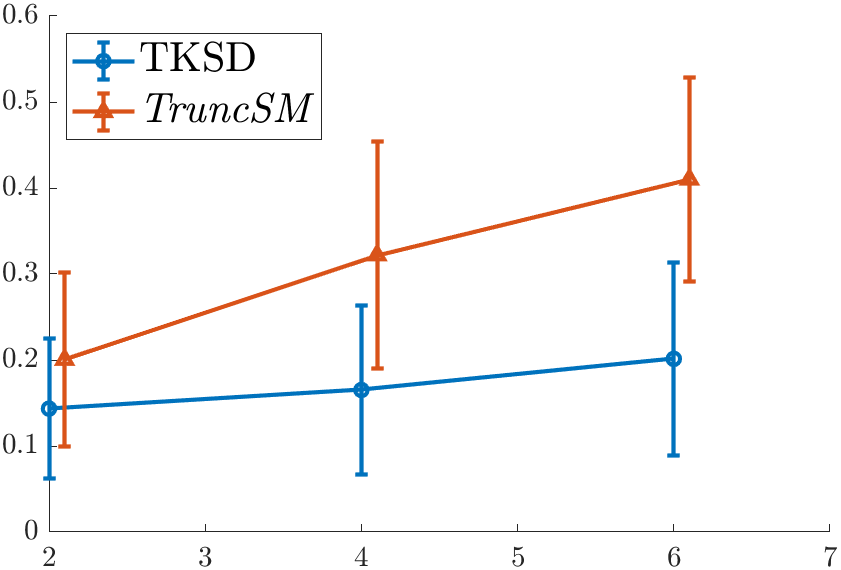
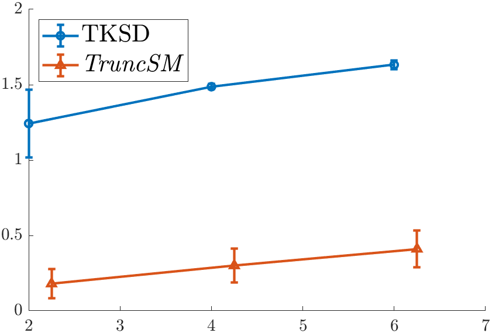
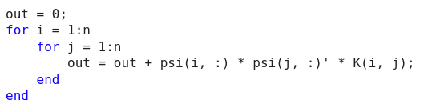
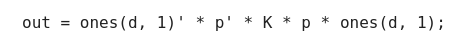

If you’re a PhD student, like me, you’ll probably have made a few (if not a lot) of mistakes over the course of your research. If you’re an aspiring PhD student, I implore you to read this post to learn about the greatest mistake I made during my studentship. This mistake was disguised, and I did not realise the implications it had.

## The Bait

In my second year of the PhD, I arrived at this incredible result.

Amazing! TKSD, which is the method I was working on, outperformed the previous state-of-the-art method, *TruncSM* by a huge margin. Across all dimensions, my error was lower, and this gap is widening as we increase the number of dimensions. *TruncSM* [[1]](#truncsm) has been described in a [previous blog post](https://dannyjameswilliams.co.uk/post/nodata/) by me.

The task given to the methods was a simple truncated density estimation problem - estimate the mean of a truncated multivariate Gaussian distribution, assuming the variance is known. We only observe a portion of our dataset, and assuming we know the truncation effect, we can give a good estimate of where the mean is. In this experiment, the true mean to be estimated was $\boldsymbol{\mu}^\star = \boldsymbol{1}_d$, the vector of ones, and whilst both methods got values close to $\boldsymbol{1}_d$, TKSD seemed a lot better. But I wouldn’t be writing this blog post if something wasn’t wrong.

## The Switch

I would like to say that at the time of performing this experiment, I was a young and naive student. But this is not true, I had already been studying at University for 5 years, doing research for maybe 2 years at this point. Instead I think I was blindsided by how excellent these initial results were, I had been working towards this goal for what at the time was my entire PhD, and was very excited that my method was working so well. After seeing these results, I did double check - I tried (in 2D) estimating different values of means $\boldsymbol{\mu}^\star$, such as $[-1, -1]$, $[0.5, 0.5]$, $[2, 2]$ and more. All worked just as well, so I thought it can’t have been a fluke. I continued with these good results, put it into a poster I presented at the University (nothing official, thankfully), and got very excited.

So what went wrong? You may have noticed that the different values of $\boldsymbol{\mu}^\star$ I double checked with were all repeated values. If we repeat the experiment where $\boldsymbol{\mu}^\star$ is different, for example, $\boldsymbol{\mu}^\star = [1, \dots, 1, -1]$, such that the last dimension of $\boldsymbol{\mu}^\star$ is -1 instead of 1, we come to a slightly different result.

Our error is not good. In fact, it is very bad indeed. So much worse in fact, that it begs the question whether the method is even working at all?

## The Reason

No, it isn’t. The method described earlier, TKSD, is not a method at all. It is a glorified bug in the code. I am going to be very slightly technical in this section to explain what I never realised for a very long time when I was working on this.

Mathematically derived, my objective function that I was minimising over had the following term in it:

$$
\sum_{i=1}^n \sum_{j=1}^n \boldsymbol{\psi}_{p, i}^{\top} \boldsymbol{\psi}_{p, j} k\left(\mathbf{X}_i, \mathbf{X}_j\right).
$$

It is not really important what this term represents, other than that involves summing over some variables twice. If you’re interested, that is the double sum over a kernel function and the score function, $\boldsymbol{\psi}$. Coding this in MATLAB, we could write something like

However, using two for loops is slow, especially when we will be evaluating this function multiple times during optimisation. Instead, we often seek to vectorise code, for which I attempted by writing

Those of you familiar with vectorisation will know that this is **not correct**. The operations are being performed in the wrong order, and what will come out of this ‘vectorised’ implementation is complete nonsense. But I fell for it. *The only way I tested if this was working was by running the first experiment*, and since it seemed to work, I never questioned it.

So there was a bug in the code, a bug that inexplicably caused good results. On its own, the vectorised implementation made no sense. To this day, I have no idea why this one particular change in the MATLAB code caused the method to *perform so well for such a randomly specific task*. Trying to estimate parameters of a different distribution doesn’t work either, nor can it be used to estimate the variance of a multivariate Normal. All attempts to do anything other than estimate a symmetrical mean fail, and give nonsensical results. But this highlights the importance of *triple checking* your work, maybe even *quadruple checking* it.

## The Payoff

This isn’t the first mistake I made, and it won’t be the last, but it was the most interesting one. What lessons have I learned from this disaster? Aside from being better at writing code for the remaining 3 years of my PhD, I will now always, **always**, **ALWAYS** verify the vectorised code against a looped implementation for a few *different* cases before confirming that it works. Don’t rely on a strangely good result to verify that your coding is correct. You will nearly always make a bug in the code, assume it is wrong before assuming anything else.

This extends further than this specific case - verification in any form of work is probably the most important thing you can do. Even under time pressure, I would prefer to make sure something is correct than to get more results that are wrong.

But this kind of thing may happen for more than just incorrectly vectorising code - your brain doesn’t always work correctly, even for long periods of time. It’s good to get a new set of eyes on anything that seems fishy. It’s good to doubt yourself and make sure you don’t blindly trust positive results.

Don’t quit when something goes wrong. It took about another whole year after this stage, but eventually, the TSKD method made it to a fully functioning and well performing method that (after extensive testing, verification, double, triple and quadruple checking) was accepted at ICML! [[2]](#tksd) [I wrote a blog post](https://dannyjameswilliams.co.uk/post/tksd/) about the finished method, if you are interested. And whilst the results aren’t *as* good as the first experiment shown here, at least it is correct!

## References

[[1]](https://www.jmlr.org/papers/volume23/21-0218/21-0218.pdf) Liu, S., Kanamori, T., and Williams, D. J. Estimating density models with truncation boundaries using score matching. *Journal of Machine Learning Research*, 23(186):1–38, 2022.

[[2]](https://proceedings.mlr.press/v202/williams23b/williams23b.pdf) Williams, D.J., Liu, S. (2023). Approximate Stein Classes for Truncated Density Estimation. *Proceedings of the 40th International Conference on Machine Learning*, in *Proceedings of Machine Learning Research*

