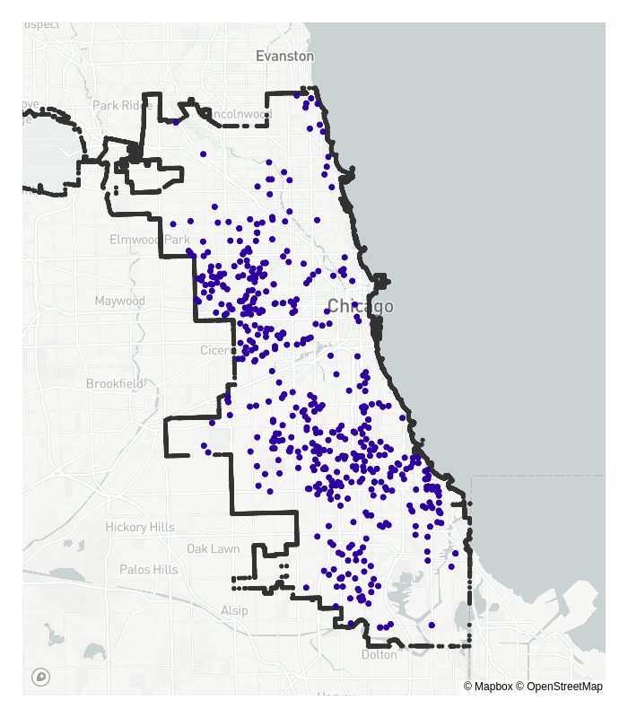
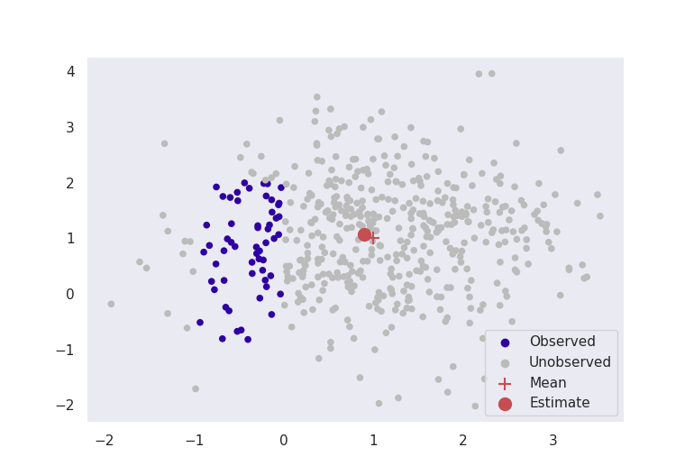
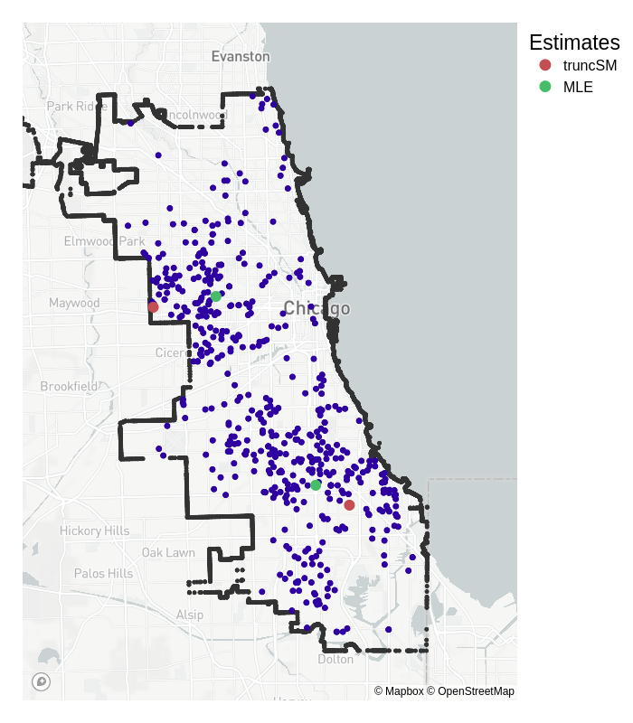

**This research serves as a pre-cursor to the work that I am carrying out as part of my PhD, and involves unnormalised and truncated probability density estimation. This is a field which I find extremely interesting, and I believe that it has far reaching applications not just across data science and machine learning, but across many other disciplines as well. This blog post is an attempt at a more accessible explanation behind some of the core concepts in [this paper (in pre-print)](https://arxiv.org/pdf/1910.03834.pdf), by Song Liu, Takafumi Kanamori and myself.** 

Firstly, consider the locations of reported crimes in Chicago below, and think about where the 'centres' of these reported crimes are. 

Now think about where typical statistical estimation methods would put these crime 'centres'. How do you think these would differ to what the 'true' centres are? Something like *maximum likelihood* estimation may be slightly incorrect in some way, because the reported crimes get cut off, or *truncated* beyond the city's borders. 

The dataset is incomplete; crimes do not magically stop where we decide the city ends, but data collection does.

This is an example of a more general problem in statistics named **truncated probability density estimation**: How do we estimate the parameters of a statistical model when data are not fully observed, and are cut off by some artificial boundary? 

## The Problem

A statistical model (a probability density function involving some parameters $\boldsymbol{\boldsymbol{\theta}}$) is defined as:

\[
p(\boldsymbol{x}; \boldsymbol{\boldsymbol{\theta}}) = \frac{1}{Z(\boldsymbol{\boldsymbol{\theta}})} \bar{p}(\boldsymbol{x};\boldsymbol{\boldsymbol{\theta}}), \qquad Z(\boldsymbol{\boldsymbol{\theta}}) = \int \bar{p}(\boldsymbol{x};\boldsymbol{\boldsymbol{\theta}})d\boldsymbol{x}.
\]

This is made up of two components:  $\bar{p}(\boldsymbol{x}; \boldsymbol{\boldsymbol{\theta}}$), the unnormalised part of the model, which is known analytically; and $Z(\boldsymbol{\boldsymbol{\theta}})$, the normalising constant. Over complicated boundaries such as city borders, *this normalising constant cannot be calculated directly*, which is why something like maximum likelihood would fail in this case.

When we perform estimation, we aim to find $\boldsymbol{\boldsymbol{\theta}}$ which makes our model density, $p(\boldsymbol{x}; \boldsymbol{\boldsymbol{\theta}})$, as closely resemble a theoretical data density, $q(\boldsymbol{x})$, as possible. Usually, we can estimate $\boldsymbol{\boldsymbol{\theta}}$ by trying to minimise some measure of difference between the $p(\boldsymbol{x};\boldsymbol{\boldsymbol{\theta}})$ and $q(\boldsymbol{x})$. But we cannot do this while $Z(\boldsymbol{\boldsymbol{\theta}})$ is unknown!

Most methods in this regard opt for a numerical approximation to integration, such as [MCMC](https://en.wikipedia.org/wiki/Markov_chain_Monte_Carlo). But these methods are usually very slow and computationally heavy. Surely there must be a better way? 

## A Recipe for a Solution

#### Ingredient #1: Score Matching

A novel estimation method called score matching enables estimation even when the normalising constant, $Z(\boldsymbol{\boldsymbol{\theta}})$, is unknown. Score matching begins by taking the derivative of the logarithm of the probability density function, i.e.,

\[
\nabla_{\boldsymbol{x}} \log p(\boldsymbol{x}; \boldsymbol{\theta}) = \nabla_{\boldsymbol{x}} \log \bar{p}(\boldsymbol{x};\boldsymbol{\theta}),
\]

which has become known as the score function. When taking the derivative, the dependence on $Z(\boldsymbol{\theta})$ is removed. To estimate the parameter vector $\boldsymbol{\theta}$, we can minimise the difference between $q(\boldsymbol{x})$ and $p(\boldsymbol{x};\boldsymbol{\theta})$ by minimising the difference between the two score functions, $\nabla_{\boldsymbol{x}} \log p(\boldsymbol{x}; \boldsymbol{\theta})$ and $\nabla_{\boldsymbol{x}} \log q(\boldsymbol{x})$. One such distance measure is the expected squared distance, so that score matching aims to minimise

\[
\mathbb{E} [\| \nabla_{\boldsymbol{x}} \log p(\boldsymbol{x}; \boldsymbol{\theta}) - \nabla_{\boldsymbol{x}} \log q(\boldsymbol{x})\|_2^2].
\]

With this first ingredient, we have eliminated the requirement that we must know the normalising constant.

#### Ingredient #2: A Weighting Function

Heuristically, we can imagine our weighting function should vary with how close a point is to the boundary. To satisfy score matching assumptions, we require that this weighting function $g(\boldsymbol{x})$ must have the property that $g(\boldsymbol{x}')$ = 0 for any point $\boldsymbol{x}'$ on the boundary. A natural candidate would be the Euclidean distance from a point $\boldsymbol{x}$ to the boundary, i.e.,

\[
g(\boldsymbol{x}) = \|\boldsymbol{x} - \tilde{\boldsymbol{x}}\|_2, \qquad \tilde{\boldsymbol{x}} = \text{argmin}_{\boldsymbol{x}'\text{ in boundary}} \|\boldsymbol{x} - \boldsymbol{x}'\|_2.
\]

This easily satisfies our criteria. The distance is going to be exactly zero on the boundary itself, and will approach zero the closer the points are to the edges.

#### Ingredient #3: Any Statistical Model

Since we do not require knowledge of the normalising constant through the use of score matching, we can choose any probability density function $p(\boldsymbol{x}; \boldsymbol{\theta})$ that is appropriate for our data. For example, if we are modelling count data, we may choose a Poisson distribution. If we have some sort of centralised location data, such as in the Chicago crime example in the introduction, we may choose a multivariate Normal distribution.

### Combine Ingredients and Mix

We aim to minimise the expected distance between the score functions, and we weight this by our function $g(\boldsymbol{x})$, to give

\[
\min_{\boldsymbol{\theta}} \mathbb{E} [g(\boldsymbol{x}) \| \nabla_{\boldsymbol{x}} \log p(\boldsymbol{x}; \boldsymbol{\theta}) - \nabla_{\boldsymbol{x}} \log q(\boldsymbol{x})\|_2^2].
\]

The only unknown in this equation now is the data density $q(\boldsymbol{x})$ (if we knew the true data density, there would be no point in estimating it with $p(\boldsymbol{x};\boldsymbol{\theta})$). However, we can rewrite this equation using integration by parts as

\[
\min_{\boldsymbol{\theta}} \mathbb{E} \big[ g(\boldsymbol{x}) [\|\nabla_{\boldsymbol{x}} \log p(\boldsymbol{x}; \boldsymbol{\theta})\|_2^2 + 2\text{trace}(\nabla_{\boldsymbol{x}}^2 \log p(\boldsymbol{x}; \boldsymbol{\theta}))] + 2 \nabla_{\boldsymbol{x}} g(\boldsymbol{x})^\top \nabla_{\boldsymbol{x}} \log p(\boldsymbol{x};\boldsymbol{\theta})\big].
\]

This can be numerically minimised, or if $p(\boldsymbol{x}; \boldsymbol{\theta})$ is in the exponential family, analytically minimised to obtain estimates for $\boldsymbol{\theta}$.

## Results

### Artificial Data

As a sanity check for testing estimation methods, it is often reassuring to perform some experiments on simulated data before moving to real world applications. Since we know the true parameter values, it is possible to calculate how far our estimated values are from their true counterparts, thus giving a way to measure estimation accuracy.

Pictured below in Figure 2 are two experiments where data are simulated from a multivariate normal distribution with mean $\boldsymbol{\mu}^* = [1, 1]$ and known variance $\sigma^2 = 1$. Our aim is to estimate the parameter $\hat{\boldsymbol{\mu}}$ to be close to $[1,1]$. The red crosses in the image are the true means at $[1,1]$, and the red dots are the estimates given by truncated score matching.

**: Points are only visible around a unit ball from [0,0].")

These figures clearly indicate that in this basic case, this method is giving sensible results. Even by ignoring most of our data, as long as we formulate our problem correctly, we can still get accurate results for estimation.

### Chicago Crime

Back to our motivating example, where the task is to estimate the 'centres' of reported crime in the city of Chicago, given the longitudes and latitudes of homicides in 2008. Our specification changes from the synthetic data somewhat:

 - from the original plots, it seems like there are two centres, so the statistical model we choose is a 2-dimensional mixed multivariate Normal distribution;
 - the variance is no longer known, but to keep estimation straightforward, the standard deviation $\sigma$ is fixed so that $2\sigma$ roughly covers the 'width' of the city ($\sigma = 0.06^\circ$).

Below I implement estimation for the mean for both truncated score matching and maximum likelihood.

Truncated score matching has placed its estimates for the means in similar, but slightly different places than standard MLE. Whereas the MLE means are more central to the truncated dataset, the truncated score matching estimates are placed closer to the outer edges of the city. For the region of crime in the top half of the city, the data are more 'tightly packed' around the border – which is a property we expect of Normally distributed data closer to its mean. 

Whilst we don't have any definitive 'true' mean to compare it to, we could say that the truncSM mean is closer to what we would expect than the one estimated by MLE. 

*Note that this result does not reflect the true likelihood of crime in a certain neighbourhood, and has only been presented to provide a visual explanation of the method. The actual likelihood depends on various characteristics in the city that are not included in our analysis, [see here for more details](https://link.springer.com/article/10.1007/s41109-019-0239-8).*

## Final Thoughts

Score matching is a powerful tool, and by not requiring any form of normalising constant, enables the use of some more complicated models. Truncated probability density estimation is just one such example of an intricate problem which can be solved with this methodology, but it is one with far reaching and interesting applications. 

Whilst this blog post has focused on location-based data and estimation, truncated probability density estimation could have a range of applications. For example, consider disease/virus modelling such as the COVID-19 pandemic: The true number of cases is obscured by the number of tests that can be performed, so the density evolution of the pandemic through time could be fully modelled with incorporation of this constraint using this method. Other applications as well as extensions to this method will be fully investigated in my future PhD projects.

### Further Reading and Bibliography

Firstly, [here is the github page](https://github.com/dannyjameswilliams/truncsm-blog) where you can reproduce all the plots made available in this blog post, as well as some generic code for the implementation of truncated score matching.

The original score matching reference:

[Estimation of Non-Normalized Statistical Models by Score Matching, Aapo Hyvärinen (2005)](https://jmlr.org/papers/volume6/hyvarinen05a/hyvarinen05a.pdf)

The paper from which this blog post originates:

[Estimating Density Models with Truncation Boundaries using Score Matching. Song Liu, Takafumi Kanamori, & Daniel J. Williams (2021)](https://arxiv.org/pdf/1910.03834.pdf)