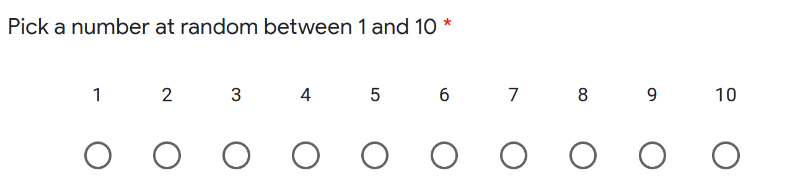
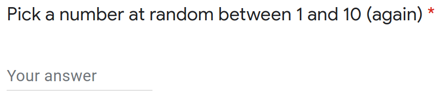
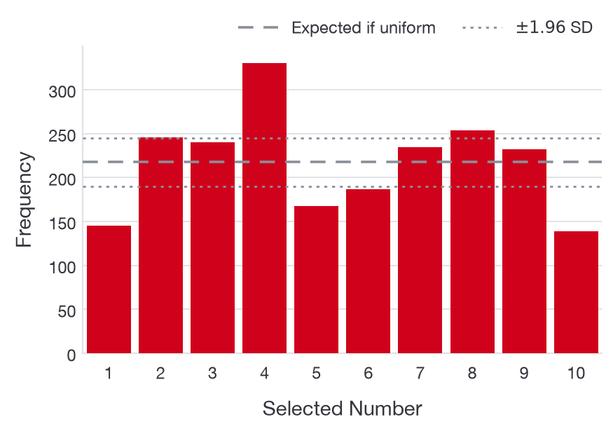
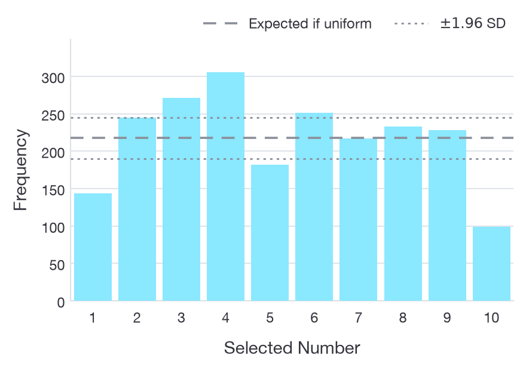
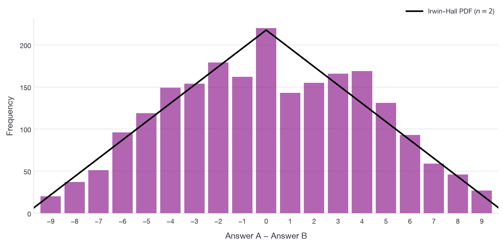
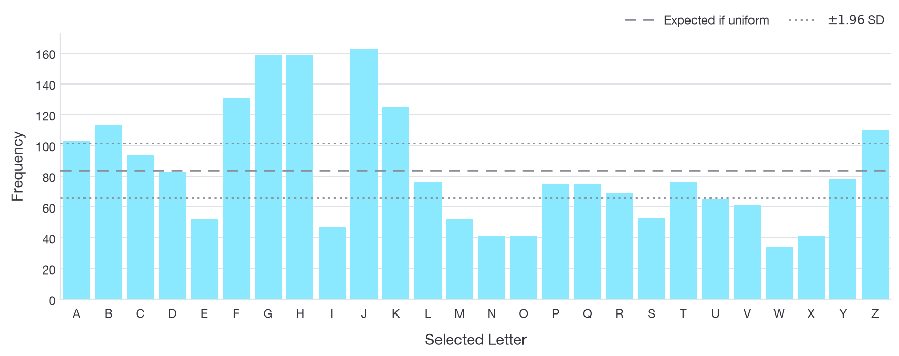
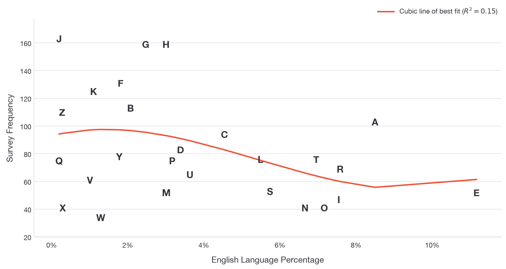
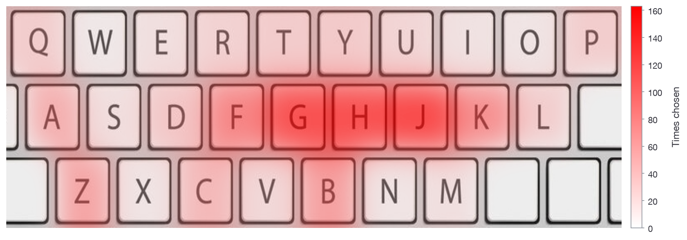
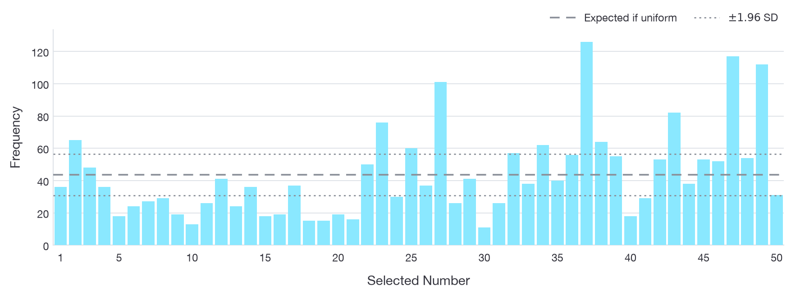

The notion of *true random* has perplexed scientists and statisticians for decades, if not longer. But there's one process that we still don't know much about - the human brain. What is it that causes our decisions to be made? When we are asked to 'pick a random number between 1 and 10', how 'random' is the number we give? Is it some complicated, deterministic signal of neurons in our brain? Or is it actually random?

The following analysis and results come from a survey collected online, which obtained $n = 2190$ participants. 

**If you're in a hurry, or don't fancy reading this article,** [**check out the handy infographic**](infographic.png).

## Pick a random number between 1 and 10, twice

This is perhaps the most basic question to ask, and one that is very visually interpretable. This question was asked in two distinct ways, pictured below:

These questions are asked with the following hypothesis: *does the answer input being on a scale change how people answer the question?* In another way, if you are picking a random number, and you can see the numbers laid out in order in front of you, are you more likely to pick a number which is more central? Let's look at the results to find out.

::: figure

Frequencies of choices between 1 and 10 for question style A (left) and question style B (right). Included is a line of the expected value $\mathbb{E}(\text{no. of choices}) = np$, plotted within a $\pm 1.96 \cdot \sqrt{\sigma}$ confidence interval, where $\sigma$ is the binomial variance.
:::

Surprisingly, both results are reasonably similar. Some statistics of these are:

 - **4 is the most frequent number in both cases**, different from the usual value of 7 that has been in similar surveys before. In the comments for this survey, people seemed to expect 7 to be the most picked. It is possible that since the participants were aware of previous research in the area, they deliberately would not have picked 7. 
 - **The average 'difference from uniformity' was around 2.1% for both types of questions**. This is the percentage difference from the expected value.
 - **10.1% of people picked the same number for both questions**, and for true random number generation, the true value would be 10%!
 - **The values at the edges, 1 and 10, were picked far less often** than values in the centre.
 - The largest difference between questions was that **10 was picked less in question type B than question type A**. A possible reason is that 10 is two digits long, which would require extra effort for question type B than for question type A.
 - A Pearson's $\chi^2$ test for uniformity showed $p$-values where $p << 0.0001$, indicating with a reasonable level of certainty that **neither sets of answers were uniformly distributed**.
 
 
So people don't seem to be entirely random in this case, but this is only one aspect of randomness. People picked the same number for both questions the correct amount of times! How about pairs of answers, i.e. for both *answer A* and *answer B*? 

::: figure

Distribution of (*answer A* - *answer B*), plotted with the expected Irwin–Hall distribution.
:::

If we subtract the answers from one another, we are essentially summing uniform random variables, which are expected to have a [Irwin-Hall distribution](https://en.wikipedia.org/wiki/Irwin%E2%80%93Hall_distribution), or a triangular distribution when we are only summing two variables. 

Put simply, imagine you are rolling two six-sided dice. The most common sum of their values is 7, since there are more combinations that can sum to 7 than anything else. The same is true in this case, we expect the most common result of *answer A* - *answer B* to be 0, and then equally 1 and -1, and so on.

Our distribution above actually does look similar to the expected triangular distribution (although we do have some oddities towards the centre of the triangle, likely caused by the lack of 1's and 10's). Does this mean human randomness isn't too bad after all? In this aspect, we are quite good with the *pairs* of our answers, even if our individual answers aren't quite as good.

## Pick a random letter from the alphabet

Okay, so we have trouble with edge effects - we don't like to pick 1s and 10s when we are trying to randomly think of a number. What if we were to randomly select a letter? There's no real intrinsic numeric value associated to a letter (unless you count its position in the alphabet), so maybe we are better at selecting a random letter. Let's take a look.

::: figure

Frequency of chosen letters arranged alphabetically.
:::

Ah, so we can't select letters randomly either, but it doesn't seem to depend on any sort of edge effects alphabetically. That is, people seem to pick A and Z a healthy amount. The frequencies for each letter are very far from what we'd expect if we were to have sampled these letters uniformly. What could have been affecting our judgement here? Maybe the popularity of a certain letter in the English language?

Plotted below is the relationship between the *frequency at which a letter occurs in the English language* (as a percentage) versus the *frequency it was picked in the survey*.

::: figure

Letter percentage in the English Language plotted against the number of times the letter was picked in the survey. The red line is a line of best fit captured from a linear regression with a cubic polynomial transform on the English language percentage.
:::

There is no significant relationship here, the $R^2$ value for a linear regression is very low, at $R^2 \approx 0.152$, meaning the model is not capturing the variability in the data. What else could be affecting how we are choosing these letters?

Earlier I stated the assumption that there was no intrinsic numeric value associated to a letter, so that we would not have any trouble with edge effects skewing the results. That assumption was wrong! If you're reading this on a computer or laptop, take a look what is just underneath your screen.

::: figure

Frequency of chosen letters as a heatmap overlaid on a keyboard.
:::

It turns out that the most frequently picked letters are those that are most central on a QWERTY keyboard. This notion of picking the most central option is corroborated by the choice of number in the first question, being that people do not like to pick numbers or letters that appear on what they consider as the 'edge'.

## Pick a random number between 1 and 50

What if our selection range is so large that these edge effects can be nullified? If we ask people to select numbers between 1 and 50, will we see an extension of what we saw in the first question? I.e. are people going to pick the most central values again (say, between 10 and 40), or will it be something else?

::: figure

Frequency of chosen numbers between 1 and 50.
:::

An interesting selection of numbers here. This range does not seem to be uniformly distributed in the slightest. Here are some facts:

- Against the expected value of 10%, only **4.3% of people selected a multiple of 10**, whereas **18.7% of people chose a number with a 7**, e.g. 17, 27 etc.
- **The lowest picked number was 30, by 0.5% of people**, and **the highest picked number was 37, by 5.8% of people**.

## Conclusions

Perhaps you remember the 'trick' that your friend would play on you as a kid in the playground. They would ask you a series of maths questions, and then ask you to *name a vegetable*. You would inevitably say 'carrot', then they'd reveal a piece of paper with the word 'carrot' on it. Were you truly tricked? Turns out, if you're asked to name a vegetable, [most people say carrot regardless](http://sciencechatforum.com/viewtopic.php?p=264070). It's not a trick, when asked to name something at random, we pick an extremely common vegetable.
