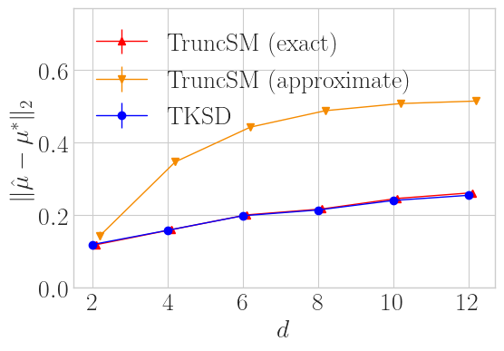
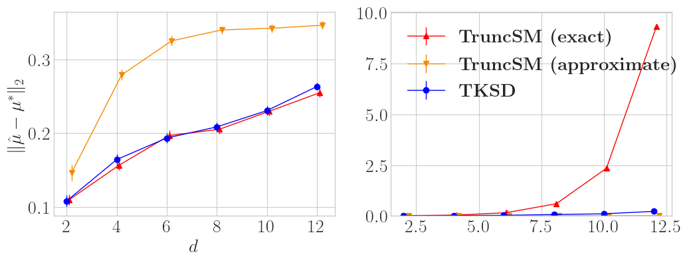
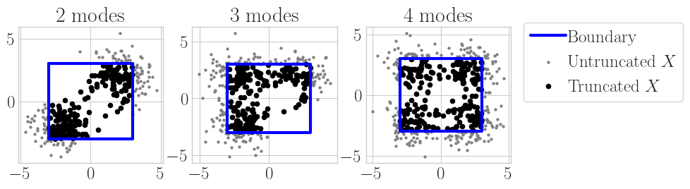
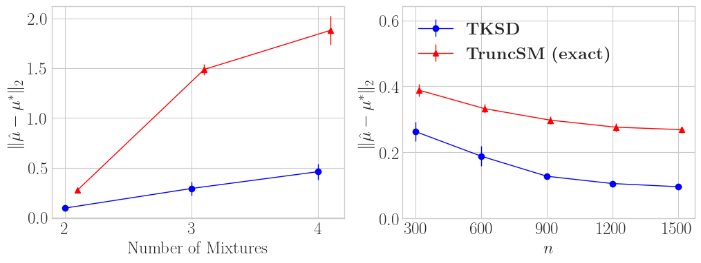
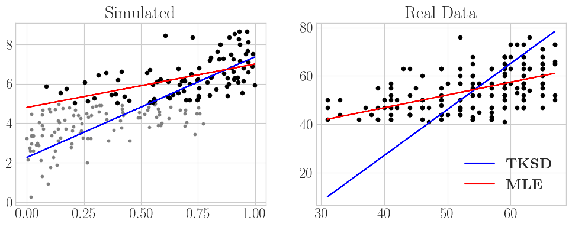

This is a blog post detailing [Approximate Stein Classes for Truncated Density Estimation](https://arxiv.org/abs/2306.00602), by myself and my supervisor, Song Liu, which recently got accepted into **ICML 2023**.

## Introduction

Pretend, for a moment, that you are the kind of person who likes to see where animals live, and you go out for the day to find where all the animal habitats are. You are interested in the broader picture; the general spread of habitat locations across a certain region. What you would be doing is looking to **model a density** based on each observation of a habitat. However, you might find that these habitats arbitrarily stop after some point, and you don’t have an exact reason why. In a similar way, you might not be allowed to cross into a neighbouring country to continue measurements. In both of these scenarios, you are prohibited from viewing a *full picture* of your dataset due to some unknown circumstances - but you *do* have access to something, which is a collection of points that roughly make up the ‘edge’ of your domain, where **your data are truncated**. *How do you estimate your density now?*

### Background

Up until the introduction of this work, to estimate the density of your wildlife habitat locations, you would probably try to use *TruncSM* [[1]](#truncsm), a very fine work which uses Score Matching [[2]](#scorematching1) to do truncated density estimation. This work is quite interesting if you are a fan of this kind of thing. If you want to read more about it I also wrote a [blog post last year](https://dannyjameswilliams.co.uk/post/nodata/) which goes into a few more details, or read [the full paper here](https://www.jmlr.org/papers/volume23/21-0218/21-0218.pdf).

The jist of the method is that our true density, $q$, (which is made up of only samples, only the wildlife habitats we observed) needs to be modelled by something which we denote as $p_{\boldsymbol{\theta}}$, which looks like

$$
p_{\boldsymbol{\theta}}= \frac{\bar{p}_{\boldsymbol{\theta}}}{Z(\boldsymbol{\theta})}, \; \; \; Z(\boldsymbol{\theta}) = \int_{V}\bar{p}_{\boldsymbol{\theta}} d\boldsymbol{x}.
$$

We can modify $p_{\boldsymbol{\theta}}$ only through $\boldsymbol{\theta}$, and so we want to find a $\boldsymbol{\theta}$ such that

$$
p_{\boldsymbol{\theta}}\approx q.
$$

This is relatively straightforward most of the time, when we integrate $Z(\boldsymbol{\theta})$ in a ‘normal’ way ($V = \mathbb{R}^d$). But this blog post is not about ‘most of the time’, we are looking at something harder ($V \neq \mathbb{R}^d$). The integration for $Z(\boldsymbol{\theta})$ is really hard. So hard in fact, that no one wants to integrate it at all (sorry $Z(\boldsymbol{\theta})$ but you’re too difficult). This is known as *unnormalised density estimation*. Well, turns out we can ignore our issues altogether if we just use Score matching. **By using Score Matching we can ignore the difficult parts of what makes estimating a truncated density hard**.

Our method, Truncated Kernelised Stein Discrepancies (what a mouthful, we’ll call it TKSD from now on), uses the same broad strokes as Score Matching, which, roughly speaking, means we also use the *score function*,

$$
\boldsymbol{\psi}_{p_{\boldsymbol{\theta}}} = \nabla_{\boldsymbol{x}} \log p(\boldsymbol{x}; \boldsymbol{\theta}),
$$

a Stein operator,

$$
\mathcal{T}_{p_{\boldsymbol{\theta}}} \boldsymbol{f}(\boldsymbol{x}) := \sum^d_{l=1}\psi_{p_{\boldsymbol{\theta}}, l}(\boldsymbol{x}) f_l(\boldsymbol{x}) + \partial_{x_l}f_l(\boldsymbol{x}),
$$

and the knowledge that \[\begin{equation} \mathbb{E}_{q} [\mathcal{T}_{q} \boldsymbol{f}(\boldsymbol{x})] = 0 \tag{1} \end{equation}\] if, for $\boldsymbol{f} \in \mathcal{F}^d$, $\mathcal{F}^d$ is a *Stein class* of functions (note that both the expectation and Stein operator are with respect to the density $q$). These three equations form the basis for a lot of unnormalised density estimation, thus it makes sense that we want to use them when developing a new method.

Instead of minimising the score matching divergence like *TruncSM*, we want to construct a discrepancy based on Minimum Stein discrepancies [[3]](#barp2019). If we want to make the two densities, $p_{\boldsymbol{\theta}}$ and $q$, as close to each other as possible, we would want to minimise [(1)](#eq:stein), since if it equals zero, then the two densities are equal. We also go one step further than that, by making this problem *as challenging as possible* by including a maximisation (supremum) over the function class also: \[\begin{equation} \min_{\boldsymbol{\theta}} \sup_{\boldsymbol{f} \in \mathcal{F}^d}\mathbb{E}_{q} [\mathcal{T}_{p_{\boldsymbol{\theta}}} \boldsymbol{f}(\boldsymbol{x})]. \tag{2} \end{equation}\] If we let $\mathcal{F}^d$ be an reproducing kernel Hilbert space (RKHS), then [(2)](#eq:minsup) can be evaluated exactly. This is called Kernelised Stein Discrepancy (KSD) [[4]](#ksd).

## TKSD: How *does* he do it?

Well, we described above what we *want* to use, but we can’t *actually* use it. All because of that pesky truncation. The issue is due to [(1)](#eq:stein) *not actually holding* when the density is truncated in a way which we do not know (recall the aim of this project is to be able to estimate the density when we do not have an exact form of the truncation boundary, and instead access it through a set of points). The actual cause is complicated, but involves the derivation of [(1)](#eq:stein), and a boundary condition on an integration by parts not holding when the density is truncated. So, we have to do something slightly different.

Two lemmas, one proposition, one remark and one final theorem later, we get the following: \[\begin{equation} \mathbb{E}_{q} [ \mathcal{T}_{q} \tilde{\boldsymbol{g}}(\boldsymbol{x}) ] = O_P(\varepsilon_m), \tag{3} \end{equation}\] for $\tilde{\boldsymbol{g}} \in \mathcal{G}^d_{0, m}$, where $\mathcal{G}^d_{0, m}$ is basically a set of functions which we optimise over (similar to $\mathcal{F}^d$ above), but also include a constraint on a *finite set of boundary points* of size $m$, such that $\tilde{\boldsymbol{g}}(\boldsymbol{x}') = 0$ for all $\boldsymbol{x}'$ in this finite set. This constraint enables the above equation to hold!

Note that [(3)](#eq:approxstein) is not an exact analogue of [(1)](#eq:stein) from before, but instead, $O_P(\varepsilon_m)$ means that it *decreases towards zero* as $m$ increases. I like to think of this as similar to sample size $n$ in most of statistics. Our accuracy increases as $n$ does, and in this case the same can be said of $m$.

🚨🚨 **Caution: Long Equation Ahead** 🚨🚨

We can minimise in the same way as [(2)](#eq:minsup). Two theorems and a long analytic solution later we obtain our objective function,

$$
\sum^d_{l=1} \mathbb{E}_{\boldsymbol{x} \sim q} \mathbb{E}_{\boldsymbol{y} \sim q} \left[ u_l(\boldsymbol{x}, \boldsymbol{y}) - \mathbf{v}_l(\boldsymbol{x})^\top(\mathbf{K}')^{-1}\mathbf{v}_l(\boldsymbol{y}) \right]
$$

where

$$
\begin{align}
u_l(\boldsymbol{x}, \boldsymbol{y}) &=\psi_{p, l}(\boldsymbol{x})\psi_{p, l}(\boldsymbol{y})k(\boldsymbol{x},\boldsymbol{y}) +\psi_{p, l}(\boldsymbol{x}) \partial_{y_l}k(\boldsymbol{x}, \boldsymbol{y}) \nonumber \\
&\qquad \qquad+\psi_{p, l}(\boldsymbol{y}) \partial_{x_l}k(\boldsymbol{x}, \boldsymbol{y}) + \partial_{x_l}\partial_{y_l}k(\boldsymbol{x}, \boldsymbol{y})
\end{align}
$$

$\mathbf{v}_l(\boldsymbol{z}) =\psi_{p, l}(\boldsymbol{z}) \boldsymbol{\varphi}_{\boldsymbol{z}, \mathbf{x}'}^\top+ (\partial_{z_l}\boldsymbol{\varphi}_{\boldsymbol{z}, \mathbf{x}'})^\top$, $\boldsymbol{\varphi}_{\boldsymbol{z}, \mathbf{x}'} = [ k(\boldsymbol{z}, \boldsymbol{x}_1'), \dots, k(\boldsymbol{z}, \boldsymbol{x}_m') ]$, $k$ is the kernel function associated with the RKHS $\mathcal{G}^d_{0, m}$, $\boldsymbol{\phi}_{\mathbf{x}'} = [k(\boldsymbol{x}_1', \cdot), \dots, k(\boldsymbol{x}_m', \cdot)]^\top$ and $\mathbf{K}' = \boldsymbol{\phi}_{\mathbf{x}'}\boldsymbol{\phi}_{\mathbf{x}'}^\top$.

**Yes this is quite a lot. No it is not important to understand every detail.** The key takeaway is that we have a loss function, consisting only of linear algebra operations, which we can minimise to obtain a truncated density estimate when the boundary is not known fully! 🎉🎉🎉

*(There are also two assumptions for one final theorem which proves this is a consistent estimator. You think this sounds like a lot of theorems? This is only mild, as far as statistics papers go.)*

## Finally something interesting, results!

I know, I know, you must be thinking “Is the estimation error across a range of experiments comparable to previous implementations of truncated density estimators considering the use of an approximate set of boundary points instead of an exact functional form?”.

Or maybe you are just thinking “Is it better than the state-of-the-art?”. Same question, really. The answer is yes, it does pretty well.

### Simulation Study

This plot shows mean estimation error over 64 trials in a simple task of estimating the mean of Gaussian distribution truncated within a $\ell_2$ ball, whilst varying the dimension $d$. We compare TKSD to *TruncSM* under two scenarios, the exact scenario is where *TruncSM* has access to the explicit boundary formulation, and the approximate scenario is where it only has access to a finite number of samples on the boundary - the same samples we give to TKSD. Overall, TKSD trades blows with *TruncSM (exact)*, and does significantly better than *TruncSM (approximate)*, even though it is given the exact same information. **So with less information, TKSD still matches the state-of-the-art method.**

This second plot shows the same experiment setup but for truncation of the $\ell_1$ ball instead of the $\ell_2$ ball. We also plot runtime for all methods. Similar to the last experiment, TKSD and *TruncSM (exact)* have comparable errors across all dimensions. The main message in this example is how *long* it takes *TruncSM (exact)* to run, because analytically calculating the functional boundary for high dimension $\ell_1$ balls is costly, combinatorically costly with $d$, in fact. *TruncSM (approximate)* is, like before, not very good, even though it is cheaper to run. Both instances of *TruncSM* have issues, whereas TKSD seems to be the superior option.

The next set of experiments contains a more complex setup, which is estimating multiple modes of a mixed Gaussian distribution. This is a similar experiment setup to before, except we are estimating 2, 3 and 4 means of a Gaussian at the same time. Figure 3 shows the experiment visually; as we vary the number of mixture modes, the distribution becomes more complex and thus harder to estimate accurately.

Figure 4 shows the mean estimation error across 64 trials for TKSD and *TruncSM (exact)*. We vary the number of mixture modes (left) from 2-4, and measure how that changes the error across both methods. We also fix the number of mixture modes as 2, and vary sample size $n$ (right), and also compare the error. Across both experiments, TKSD is Ivan Drago, and *TruncSM* is Apollo Creed (sorry). **TKSD has a significantly smaller error than *TruncSM*.**

### Regression Example

Let’s look at one specific example before we go, a simple linear regression. Since TKSD is a density estimation method, we can use it to estimate parameters of the (conditional) mean of a Normal distribution, given some feature variables. Truncation happens in the $y$ domain, so that all of our data is truncated according to conditions on $y$. In the first plot, we simulate a regression setting where we know the true parameters and can see the untruncated data. We pretend to only observe $y_i \geq 5$, $\forall i = 1,\dots, n$, and fit the model to the remaining data. When comparing the TKSD fit to a naive least squares implementation (MLE) which does not account for truncation, you can clearly see the difference that accounting for this simple truncation makes in our regression line.

The second plot is an experiment on a real-world dataset, given by UCLA: Statistical Consulting Group [[5]](#data). This dataset contains student test scores in a school for which the acceptance threshold is 40/100, and therefore the response variable (the test scores) are truncated below by 40 and above by 100. Since no scores get close to 100, we only consider one-sided truncation at $y = 40$. The aim of the regression is to model the response variable, the test scores, based on a single covariate of each students’ corresponding score on a different test. We see very clearly in this example that accounting for this truncation seems to give a better fit than a regular least squares solution.

## Conclusions

This work has taken up the majority of my PhD, around 2 years. It is more complicated than I have given it credit for in this post, and please do read the full paper if you want more detail. Even with all the detail, it is not a work that would normally take 2 years. It started as a way of extending the previous implementation we developed in *TruncSM*, to try and adaptively solve for what we were calling a ‘boundary function’. It became clear that score matching was holding us back, and then we kept having to add extra constraints and details to an implementation around Stein discrepancies. Amongst loads of different ideas, things also kept going wrong, so it is a great relief to see this research finished, working, and even performing extremely well, not to mention being accepted to ICML!

Anyway, why would you be interested in TKSD in general? If you care about truncated densities, and want something that is

- adaptive to the dataset at hand
- requires no prior knowledge about the boundary, except being able to obtain samples from it
- performs better in more complicated scenarios
- has a nice theoretical and empirical results
- is an acronym

then look no further than TKSD!

## References

[[1]](https://www.jmlr.org/papers/volume23/21-0218/21-0218.pdf) Liu, S., Kanamori, T., and Williams, D. J. Estimating density models with truncation boundaries using score matching. Journal of Machine Learning Research, 23(186):1–38, 2022.

[[2]](https://www.jmlr.org/papers/volume6/hyvarinen05a/hyvarinen05a.pdf) Hyvärinen, A. Estimation of non-normalized statistical models by score matching. Journal of Machine Learning Research, 6(24):695–709, 2005.

[[3]](https://proceedings.neurips.cc/paper_files/paper/2019/file/ba7609ee5789cc4dff171045a693a65f-Paper.pdf)  Barp, A., Briol, F.-X., Duncan, A., Girolami, M., and Mackey, L. Minimum stein discrepancy estimators. In Advances in Neural Information Processing Systems, volume 32, 2019.

[[4]](http://proceedings.mlr.press/v48/chwialkowski16.pdf) Chwialkowski, K., Strathmann, H., and Gretton, A. A kernel test of goodness of fit. In Proceedings of The 33rd International Conference on Machine Learning, volume 48 of Proceedings of Machine Learning Research, pp. 2606–2615. PMLR, 2016

[[5]](https://stats.oarc.ucla.edu/stata/dae/truncated-regression/)  UCLA: Statistical Consulting Group. Truncated regression — stata data analysis examples. URL [https://stats.oarc.ucla.edu/stata/dae/truncated-regression/](https://stats.oarc.ucla.edu/stata/dae/truncated-regression/). Accessed March 17, 2023.

